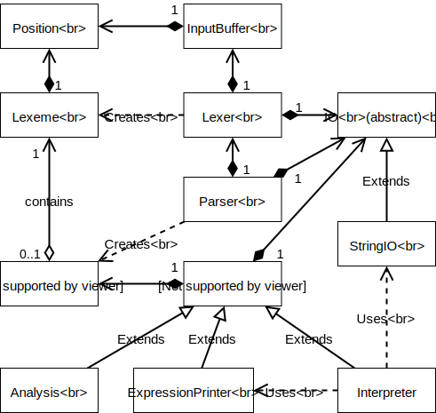
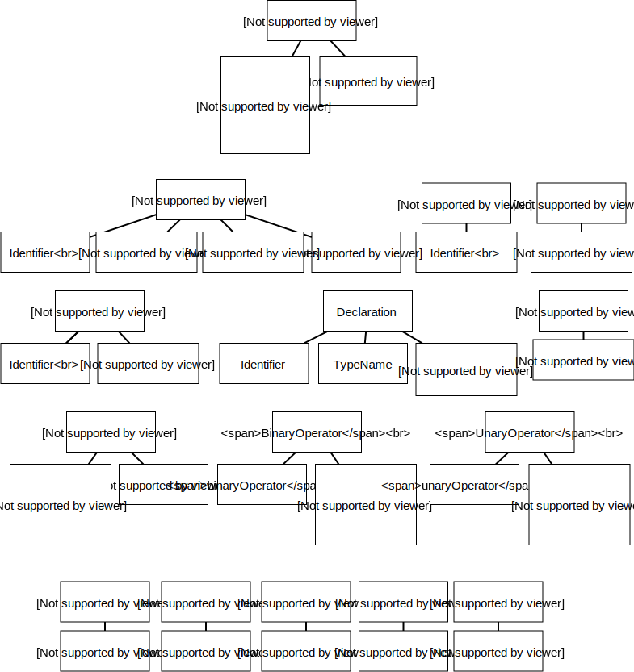
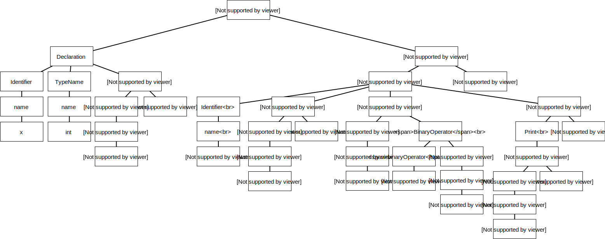

# Interpreter
- Course: Compilers https://courses.helsinki.fi/fi/csm14204/119559595
- Student: Risto Mikkola
- Project: Interpreter
- Date of delivery: 31.3.2018
- View repository and README.md online: https://github.com/Rochet2/compilers/


## Repository layout
- project root contains different folders, the licence, readme and project solution file
- documents folder contains diagrams, original assignment PDF files and other documents
- Interpreter folder contains the program source code and tests
- tests for a file `Filename.cs` are in a file called `Filename.test.cs` in the same folder
- `Interpreter/TestCode.txt` is a file that is set up to be the file run by MonoDevelop automatically

## Architecture


The UML diagram above shows how relevant parts of the program are connected on a high level.
Next we will explain the purpose of each of the parts in the diagram.

- `IO` is an abstract class that IO classes inherit. The IO classes implement read and write functions to support input and output operations. The purpose of the `IO` class is to abstract away the IO implementation to allow flexibility for example for testing.
- `StringIO` implements `IO` and it is initialized with a specific input and it contains a string where it outputs any output. The purpose of it is to allow in memory printing of IO.
- `Position` is a class that contains information about a location in the source file. It has the line number and the character number on that line (column).
- The `InputBuffer` owns a `Position` that it updates to match the position of input it has read. The purpose of the `InputBuffer` is to read characters from the input to the buffer to allow having a lookahead that we can peek.
- `Lexeme` is a class that contains a `Position`, a token string and the type of the token. The purpose of it is to contain all relevant information from the lexical analysis of the token.
- The `Lexer` owns an `InputBuffer` and it reads characters from it. The purpose of the `Lexer` is to perform lexical analysis on the characters being read and produce `Lexeme` from them. It uses the `InputBuffer`'s lookahead to try deduce what type of token it should be expecting. It will copy the `Position` of the `InputBuffer` to the `Lexeme` it produces. The `Lexer` owns an IO instance where it outputs any error messages.
- `ASTNode` is an abstract class that contains the type of the `ASTNode` and may contain a `Lexeme`. The purpose of the `ASTNode` is to allow building the abstract syntax tree (AST) from tokens. The child classes that inherit this class can specialize themselves in different ways.
- `ASTVariableNode` is not in the diagram, but it is an abstract class that inherits `ASTNode`. The purpose of it is to act as the common high level class for all values that can be printed or stored. It contains an overridable function that returns the value of the variable.
- `Parser` is a class that owns a `Lexer` to read tokens from and an `IO` instance to output error messages to. The purpose of it is to read `Lexeme` from the `Lexer` and build an AST from them by creating `ASTNode`s according to an LL1 grammar it follows.
- `Visitor` is an abstract class that implements basic utilities for Visit pattern to be used on an AST made of `ASTNode`. It owns an `ASTNode` which is the root of the AST and an `IO` to which it outputs any error messages. The class also implements a variable store and type assertion and checking functions to be used by the child classes that inherit it. The purpose of the `Visitor` class is to provide commonly used functionality for other visitor pattern classes that walk through the AST.
- `Analysis` is a class that inherits the `Visitor` class. The purpose of it is to implement the visit functions and other functionaltiy needed for performing semantic analysis on an AST. It can throw `VisitorException`, which is catched and outputted by the `Visitor` super class.
- `ExpressionPrinter` is a class that inherits the `Visitor` class. The purpose of it is to implement the visit functions and other functionaltiy needed for printing the tokens of an `ASTNode` tree, which consists of an expression, to the given `IO`. It can throw `VisitorException`, which is catched and outputted by the `Visitor` super class.
- `Interpreter` is a class that inherits the `Visitor` class. The purpose of it is to implement the visit functions and other functionaltiy needed for interpreting an AST. It will use the inherited `IO` to read user input during execution when needed. It also uses `ExpressionPrinter` to walk the assertion condition expression for printing the expression in a diagnostic message. To catch the output of the `ExpressionPrinter` it will use `StringIO`. It can throw `VisitorException`, which is catched and outputted by the `Visitor` super class.
- The `MainClass`, which contains the program entry point, will create an instance of an `IO` and `InputBuffer` and then give them to all class instances it creates. Then it will create a `Lexer` and run it, create a `Parser` and run it, create an `Analysis` and run it and finally create an `Interpreter` and run it. At each stage it can exit if errors block it from continuing.


What is missing from the diagram are the enums, the classes that are used for testing, the classes that extend `ASTNode`, exception classes, the main program class that uses most other classes and the ConsoleIO class that the main program creates to be used as the IO when the Main function is run. Also any standard library classes are not shown. Connections that are not shown are the indirect connections for example where `Analysis` could print the `Position` of a `Lexeme`.

#### Architectural decisions
Here are some additional architectural decisions that were made.
They were not specified or not clearly defined in the specification of the interpreter.
- assert will stop the program from executing if the assertion fails (condition is false). Programs with failed assertions are running in undefined manner and must be stopped. 
- for-loop control variable will be at end value + 1 after the for loop ends or if for loop is never entered then it will be set to the for-loop range beginning value. This appeared to be the needed behavior for one of the example programs given in the specification.
- if a non numeric or invalid numeric value is read from input during program execution the program will keep on reading until a valid number is read. This is for convenience as you may press enter or input a letter accidentally.
- editing the control variable is prohibited through checking mutability during semantic analysis and runtime. Control variable immutability was specified in the specification, but whether the control variable should be only internally immutable or immutable in the whole program was not specified, so the latter was chosen.
- nested block comments such as `/*/**/*/` are accepted, however `/*/**/` is not. All block comments must be complete, even the nested ones. The reason for this is that if the second example is accepted we would need to read the whole input to test if another block comment end is found and backtrack if the comment end was not found and we want to avoid backtracking so we do not accept such situations.
- boolean < operator is defined so that it is true when left operand is false and right operand is true, false otherwise. The specification defined that all types need to have < operator, but it did not specify how. Other values have common approaches, but booleans do not usually implement < operator. Due to this a decision was made on how to implement it.
- default values for each type are: int `0`, string `""`, bool `false`. These were not specified, but are commonly used elsewhere.
- a number value that is too high for the C# runtime is considered an error or invalid. This decision was made due to limitations imposed by implementation specific types.
- an invalid program will not be attempted to be fixed. This was decided because we may not know what was intended and we may cause completely invalid errors from making wrong deductions.
- a program with multiple lexical and parse errors will have all the detected errors printed, however only the first printed error is completely valid and any subsequent errors can be caused by the first error. Additionally when any error occurs in this phase the semantic analysis and interpreter are not run. This was decided because the running the program and the semantics of a program that has invalid tokens or syntax will not properly make sense and reporting of multiple errors is very convenient.
- a program with multiple semantic errors will have all the errors printed, however only the first printed error is completely valid and any subsequent errors can be caused by the first error. Any semantic error blocks the interpreter from running.
- lexical analysis will skip to the next new line in case an error occurs. This was decided because reporting of multiple errors is very convenient and an error, such as a string error, will cause the rest of the line to be considered as a string.
- strings are limited to the end of a new line. Any new lines in a string must be represented with the escape sequence `\n`. This was decied because now runaway strings will not block reporting of errors on other lines.
- strings only support the following escape sequences: `\n` for new line, `\"` for a quote, `\t` for a tab. These were chosen because they are most useful.
- parser will skip to the next statement if an error occurs. This was decided because statements should be logically sound entities we can easily tell apart from each other and reporting errors on each statement is convenient.
- semantic analysis will skip to the next statement if an error occurs. This was decided because statements should be logically sound entities we can easily tell apart from each other and reporting errors on each statement is convenient.
- a blockcomment can contain new lines and if the comment has no ending it will cause the whole rest of the program to be attempted to be interpreted as a block comment, which will fail.
- invalid operators are not considered invalid until the semantic analysis or running the interpreter. This allows a better error message output.
- for-loops only support number ranges. This was decided because it is logical.
- for-loops can have bigger begin than end index, which causes the for-loop to never execute. This was decided because it is common.

## Testing
Testing methods included unit testing and system testing. The tests consist of running the given example programs, programs producing expected errors and ad-hoc testing related to functionality or feature being developed. In short the test data consists of all expected error cases and some known valid programs.

Unit tests:
- InputBuffer is tested for all functions
- StringIO is tested for all functions
- Lexer is tested for all functions
  - including cases such as skipping whitespace and nested comments
  - recognizing all token types (string, number, comment, keyword, identifier, ...)
- setting error flags for each error handling mechanism (Lexer, Parser, ...)


System tests:
- all error programs from the `Error handling` section in this document
- the example programs given in `Mini_pl_syntax_2018` document
- Parser: `print 1; end; print 2;`, which was causing parsing to stop without errors at the `end;` statement due to incorrect for-loop handling in parser
- Interpreter: reading of values, writing of values


Manually tested:
- ConsoleIO was tested manually by programs that read and print values
- Each implemented keyword and functionality during development


## Building and running
- Developed using:
  - Ubuntu 16.04
  - Mono 5.8.0.129
  - MonoDevelop Version 7.4 (build 1035)
  - NUnit 3.10.1

#### Docker
- This project has a docker build in docker-hub.
  - Install docker
  - Get the image with `docker pull rochet2/compilers`
  - Test the image with `docker run --rm rochet2/compilers`
  - To run your own code, create a text file, for example `code.txt`
  - Then create a container with `docker create --name compilers -v $(pwd)/code.txt:/Interpreter/TestCode.txt rochet2/compilers`
  - Then run the code from the text file with `docker start -i compilers`

#### Environment
- You must first install the development environment.
  - Mono installation: http://www.mono-project.com/download/stable/
    - Use `sudo apt-get install mono-complete`
  - Monodevelop installation: http://www.monodevelop.com/download/
- Download or clone the Interpreter repository.
- Open MonoDevelop and in the opening screen select to open a solution.
- In the dialog that opens find `Interpreter.sln` which is inside the repository clone, select it and click open.
- Make sure that you have internet connection as you open the sln file since NUnit is downloaded if it does not exist.
  - If NUnit it is not installed automatically, you should make sure you have NuGet package manager installed in MonoDevelop and then install NUnit package with it.

#### Development
- For development
  - edit `TestCode.txt` inside the cloned repository to contain your code.
    - the file is preconfigured to be used by default when the interpreter is run through MonoDevelop.
  - select `Debug` from the dropdown on the top left.
  - press the play button to compile and run the interpreter with `TestCode.txt` as the input file.
  - To run NUnit tests from the top navigation in MonoDevelop select `Run` and under it select `Run unit tests`.

#### Releasing
- For release
  - to build the program select `Release` from the top left.
  - click `build` at the top menu bar and select `build all`.
  - After building go to `/Interpreter/bin/Release` inside your repository clone and in it you can see `Interpreter.exe`.
  - You can move the `Interpreter.exe` to some other folder if you want to.
  - To run the program you must first enable executing rights to the `Interpreter.exe`. This can usually be done by right clicking it, selecting properties, selecting permissions and ticking the box for allowing to execute the file as a program.
  - Create a file you want to execute next to the `Interpreter.exe`, for example `code.txt` containing `print "Hello world\n";`.
  - Open a command prompt in the same folder as the `Interpreter.exe`
  - Then use the command `./Interpreter.exe code.txt` to run the file you created.
    - The program takes exactly one argument, which is the absolute or relative path to the file to interpret.
    - The interpreter will print errors if it finds any. The first error printed is the first error found. Any errors printed after that may be caused by the first error detected.
    - If no errors are detected the code is run and any errors during execution halt the program execution. Assert WILL halt the program execution.

## Token patterns
- Number, regex: `%d+`
- Comment, regex: `//[^\n]*`
- String, regex: `"(\\[^\n]|[^"\n])*"`
- Block comment, regular definition:
  ```
  comment := "/*" commentend
  commentend := ([^/][^*] | comment)* "*/"
  ```
- Identifier, regex: `(\a|_)(\a|\d|_)*` any identifier that matches a list of keywords is converted to a keyword

Any other tokens are matched as the token themselves - these are NOT regex patterns or regular definitions - it makes little sense describing them with regex or regular definitions due to their length and nature of being exact match. They are the following:
- `:=`
- `..`
- `(`
- `)`
- `:`
- `;`
- `<`
- `=`
- `!`
- `&`
- `+`
- `-`
- `/`
- `*`


Additionally any whitespace is skipped. The whitespace characters are more specifically defined in [https://msdn.microsoft.com/en-us/library/t809ektx(v=vs.110).aspx](https://msdn.microsoft.com/en-us/library/t809ektx(v=vs.110).aspx).
Other tokens are handled as unexpected tokens.

## LL1 grammar
```
STMTS -> STMT ";" STMTSTAIL
STMTSTAIL -> STMTS | ε
STMT -> "var" IDENT ":" TYPE VARTAIL | IDENT ":=" EXPR | "for" IDENT "in" EXPR ".." EXPR "do" STMTS "end" "for" | "read" IDENT | "print" EXPR | "assert" "(" EXPR ")"
VARTAIL -> ":=" EXPR | ε
EXPR -> OPND EXPRTAIL | UNARYOP OPND
EXPRTAIL -> OP OPND | ε
OPND -> INT | STRING | IDENT | "(" EXPR ")"
TYPE -> "int" | "string" | "bool"
```

#### Verification of the grammar
Verification results:
- All nonterminals are reachable and realizable
- The nullable nonterminals are: STMTSTAIL VARTAIL EXPRTAIL
- The endable nonterminals are: STMTS STMTSTAIL
- No cycles
- The grammar is LL1
- [View results](http://smlweb.cpsc.ucalgary.ca/vital-stats.php?grammar=STMTS+-%3E+STMT+%3B+STMTSTAIL.%0D%0ASTMTSTAIL+-%3E+STMTS+%7C+.%0D%0ASTMT+-%3E+var+IDENT+%3A+TYPE+VARTAIL+%7C+IDENT+%3Aq+EXPR+%7C+for+IDENT+in+EXPR+dd+EXPR+do+STMTS+end+for+%7C+read+IDENT+%7C+print+EXPR+%7C+assert+%28+EXPR+%29.%0D%0AVARTAIL+-%3E+%3Aq+EXPR+%7C+.%0D%0AEXPR+-%3E+OPND+EXPRTAIL+%7C+UNARYOP+OPND.%0D%0AEXPRTAIL+-%3E+OP+OPND+%7C+.%0D%0AOPND+-%3E+INT+%7C+STRING+%7C+IDENT+%7C+%28+EXPR+%29.%0D%0ATYPE+-%3E+int+%7C+string+%7C+bool.%0D%0AINT+-%3E+intliteral.%0D%0ASTRING+-%3E+stringliteral.%0D%0AIDENT+-%3E+identifier.%0D%0AUNARYOP+-%3E+unaryop.%0D%0AOP+-%3E+op.)
- [View LL1 parsing table](http://smlweb.cpsc.ucalgary.ca/ll1-table.php?grammar=STMTS+-%3E+STMT+%3B+STMTSTAIL.%0ASTMTSTAIL+-%3E+STMTS+%7C+.%0ASTMT+-%3E+var+IDENT+%3A+TYPE+VARTAIL+%7C+IDENT+%3Aq+EXPR+%7C+for+IDENT+in+EXPR+dd+EXPR+do+STMTS+end+for+%7C+read+IDENT+%7C+print+EXPR+%7C+assert+%28+EXPR+%29.%0AVARTAIL+-%3E+%3Aq+EXPR+%7C+.%0AEXPR+-%3E+OPND+EXPRTAIL+%7C+UNARYOP+OPND.%0AEXPRTAIL+-%3E+OP+OPND+%7C+.%0AOPND+-%3E+INT+%7C+STRING+%7C+IDENT+%7C+%28+EXPR+%29.%0ATYPE+-%3E+int+%7C+string+%7C+bool.%0AINT+-%3E+intliteral.%0ASTRING+-%3E+stringliteral.%0AIDENT+-%3E+identifier.%0AUNARYOP+-%3E+unaryop.%0AOP+-%3E+op.&substs=)

Grammar verified at [http://smlweb.cpsc.ucalgary.ca/start.html](http://smlweb.cpsc.ucalgary.ca/start.html).
Grammar converted to suitable form for the verification tool:
```
STMTS -> STMT ; STMTSTAIL.
STMTSTAIL -> STMTS | .
STMT -> var IDENT : TYPE VARTAIL | IDENT :q EXPR | for IDENT in EXPR dd EXPR do STMTS end for | read IDENT | print EXPR | assert ( EXPR ).
VARTAIL -> :q EXPR | .
EXPR -> OPND EXPRTAIL | UNARYOP OPND.
EXPRTAIL -> OP OPND | .
OPND -> INT | STRING | IDENT | ( EXPR ).
TYPE -> int | string | bool.
INT -> intliteral.
STRING -> stringliteral.
IDENT -> identifier.
UNARYOP -> unaryop.
OP -> op.
```

## AST representation

All of the nodes contain a `Lexeme` and the type of the node in addition to data represented in the diagrams below.
No value can be null unless otherwise specified. All names starting with uppercase name are `ASTNode` child classes. Any names starting with lowercase letter are some common type such as string, or int. Many nodes have alternative node types that they can contain, they are represented as a single node where each node type is separated by an `or`. Any note, such as `can be null`, is marked in parenthesis below the node's possible types. The diagrams are read from top down and they attempt to represent tree structures where the root node is at the top. Any higher node will own all the nodes below it that are connected to it with a line. `Boolean` is a special type which cannot appear in the AST built by the parser because nothing in the grammar can directly define a boolean value, it will however be generated during runtime after evaluating expressions that evaluate to a boolean value.

The diagram below shows all node classes and what they can contain. AST is built by combining these nodes. The root node of an AST is a `Statements` node, however other nodes are possible to be used as the root with visitors, for example `ExpressionPrinter` assumes the root node to be `Expression` or any node that `Expression` can contain.




Below you can see the AST of the following small program:
```
var x : int := 1;
for x in 1..(2+x) do // from 1 to 3
    print x;
end for;
```



## Error handling
Error handling is done by exceptions. Any error that occurs throws an exception with any relevant information such as an error message and current position or node. The caller of the function or some higher level will catch the exception and handle it by aborting or alternatively skipping to the next line or statement to continue reporting errors. Any error detected will set `errored` flag to true for that specific object that experienced the error.

Below are listed the specifics for each part of the program. Note that the amount of errors listed may not match the amount of example programs because the list of errors is a list of errors that are tested in semantic and runtime analysis and may not be producible through code unless the interpreter is broken or alternatively more cases were demonstrated for some checked errors.

#### Lexer
The Lexer will throw an exception when an unexpected charcter is found or no character is found when one is expected. This charcter can be either unknown or unexpected in the middle of some token pattern. The exception is catched in the function that calls any pattern recognisers and it will set the error flag to true, print the error message and skip to the next new line if any. The reason for skipping to the next line is that any errors will be limited to that line and strings will also end at the new line, which prevents falsely interpreting for example a semicolon inside a string as the end of a statement. The error message will contain the line and column on that line where the error originated from. Some errors may contain extra information, for example an error for a string may contain the position where the error occurred as well as the position where the string starts at. Lexer errors allow parsing to be done, but will not allow semantic analysis or interpreting to start since the program cannot be valid if some tokens are missing.

List of checked errors:
```
unrecognized token
too high constant number
unknown escape character in string literal
endless string
endless blockcomment
```

Example programs:
```
unrecognized token #;
print 99999999999999999999999; // too high constant
print "test \x"; // unknown escape character in string literal
"endless string
/* endless block comment
```

#### Parser
The Parser will throw an exception when an unexpected token is found or no token is found when one is expected. The tokens are checked for their content and type when applicable. The exception is catched in either in the function that handles statements or the root function that initiates the whole parsing process and after catching the exception it is handled by setting the error flag to true, printing the error message and skipping to the next statement if any. The reason for skipping to the statement is that any errors will be limited to a statement and the statements can be identified through the semicolon easily. The reason for the two level catch is that statements can be inside a for loop and we want to process all statements inside a for loop as well as the main program statements. Additionally the root of the parsing can throw errors if there are tokens after the program statements so we must catch errors outside of the statement handling. Parsing errors will not allow semantic analysis or interpreting to start since the program cannot be valid if the program does not conform to the grammar. The error messages will contain information about what token was expected, what was received instead and from where in the source code the error originated from.

List of checked errors:
```
token type does not match expected
token value does not match expected
empty statement
missing tokens trigger "expected <something>"
tokens after program end
```

Example programs:
```
assert 0 token type does not match expected 0;
assert ) token value does not match expected (;
; // empty statement
var X :; // missing tokens
123 // tokens after program end
```

#### Analyser
The Analyser will throw an exception when a semantic error is detected. The types, definitions, immutability, operators and other constraints are checked from the AST nodes. The exception is catched in either in the function that handles statements or the root function that initiates the whole analysing process and after catching the exception it is handled by setting the error flag to true, printing the error message and skipping to the next statement if any. The reason for skipping to the statement is that statements are logical entities, any errors will be limited to a statement and the statements can be identified easily as they are chained. The reason for the two level catch is that statements can be inside a for loop and we want to process all statements inside a for loop as well as the main program statements. Semantic errors will not allow interpreting to start since the program cannot run without error if the program is not semantically valid.

List of checked errors:
```
reassigning variable not defined
reassigning variable types dont match
forloop range begin is not number
forloop range end is not number
forloop range variable not defined
forloop range variable is not number
variable declaration already defined
variable declaration type unknown
variable declaration type doesnt match assigned value type
identifier not defined
read identifier not defined
read identifier type not supported (bool)
assert condition is not boolean
statements dont return null (untestable)
print value not printable (untestable)
binary operator unknown for given operands
unary operator unknown for given operand
variable is immutable due to a forloop (cannot assign, read, use in nested forloop)
```

Example programs:
```
x := 5; // x not defined
var x : int; x := "string"; // wrong type
var g1 : int; for g1 in (1=1)..2 do print g1; end for; // begin not number
var g2 : int; for g2 in 1..("str") do print g2; end for; // end not number
for y in 1..2 do print y; end for; // loop variable not defined
var y : string; for y in 1..2 do print y; end for; // loop variable not a number
var z : bool; var z : bool; // duplicate define
var a : print; // unknown variable type
var b : bool := "str"; // variable type and value mismatch
print c; // c not defined
read d; // d not defined
var e : bool; read e; // e not readable type (bool)
assert (5); // assert condition not boolean
print 1&2; // invalid integer operator
print 1&"a"; // invalid binary operator
print &1; // invalid unary operator
var x1 : int; for x1 in 1..2 do x1 := 10; end for; // variable is immutable due to a forloop (assign)
var x2 : int; for x2 in 1..2 do read x2; end for; // variable is immutable due to a forloop (read)
var i : int; for i in 1..2 do for i in 1..2 do var x3 : int; end for; end for; // variable is immutable due to a forloop (nested forloop)
```

#### Interpreter
The Interpreter will throw an exception when a runtime error is detected. The types, definitions, immutability, operators and other constraints are checked from the AST nodes. The exception is catched in either in the the root function that initiates the whole program execution and after catching the exception it is handled by setting the error flag to true, printing the error message and aborting completely. The reason for aborting execution is that when an error occurs, any execution after that is undefined behavior.

List of checked errors:
```
Same as analyser plus..
assertion failed
```

Example programs:
```
assert (1=2); // assertion fails, program aborts and an error message is printed. Error message contains the assert condition.
```
